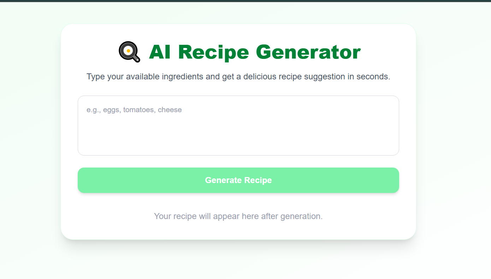
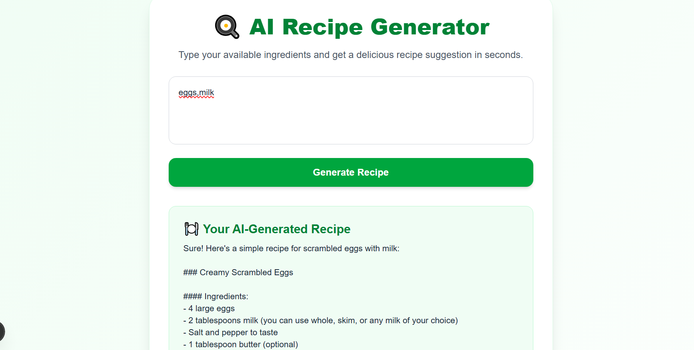
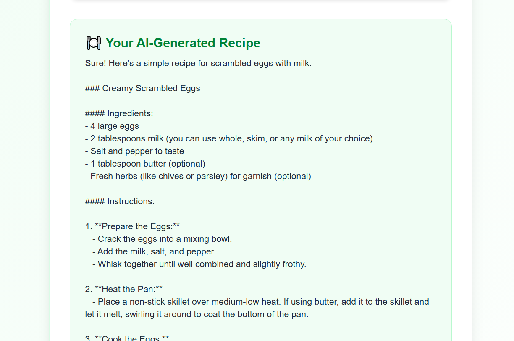
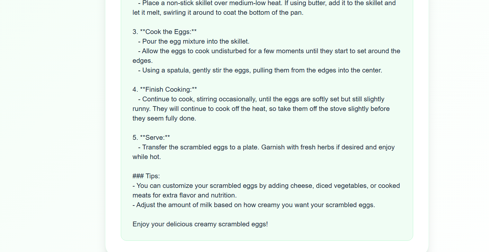

# 🧠 AI-Powered Recipe Generator

A modern, full-stack **AI Recipe Generator** app where users can log in via magic link, generate delicious recipes using AI, and view/download results — all powered by Supabase, MongoDB, and n8n.

> 🚀 **Live Demo:** [nexium-fatima-recipe-generator.vercel.app](https://nexium-fatima-recipe-generator.vercel.app/)

---

## ✨ Preview

**🖼️ Pic 1: Home Page**
  


---

**🖼️ Pic 2: Ingredient Input Page**



---

**🖼️ Pic 3: Generated Recipe Script**



---

**🖼️ Pic 4: Displaying the Recipe in Detail**



---

**🖼️ Pic 5: Listen to AI-generated Recipe **



---

## 🧩 Features

- 🔐 **Magic Link Auth** via Supabase
- 📝 **Recipe Script Generation** powered by LLM (via n8n + OpenRouter)
- 💾 **MongoDB + Supabase** for dual persistence
- 🎯 Deployed on **Vercel** with automatic CI/CD
- ⚡ Fast, responsive, and clean UI

---

## 🛠️ Tech Stack

| Layer         | Technology               |
|---------------|---------------------------|
| **Frontend**  | Vercel, Next.js/React     |
| **Auth**      | Supabase Magic Link       |
| **Backend**   | n8n (AI generation logic), gTTS, Python Flask (or FastAPI) |
| **Database**  | Supabase PostgreSQL + MongoDB |
| **AI API**    | OpenRouter / OpenAI       |
| **CI/CD**     | Vercel                    |

---

## 🚀 Getting Started (Local Development)

### 1. Clone the Repository

```bash
git clone https://github.com/your-username/recipe-generator.git
cd recipe-generator
```
2. Install Dependencies

```
npm install  # or yarn
```

3. Environment Variables
Create a .env file and add:

```
SUPABASE_URL=your_supabase_url
SUPABASE_ANON_KEY=your_supabase_anon_key
OPENROUTER_API_KEY=your_openrouter_key
```

4. Run the Development Server
```
npm run dev
Open http://localhost:3000 in your browser.
```
🧪 How It Works
User logs in via Supabase magic link.

User enters a topic like "Quick Vegan Dinner".

Frontend sends request to backend API (Python or n8n).

n8n orchestrates an LLM request to generate a recipe script.

Script is parsed and synthesized into audio via gTTS.

Both text and audio are stored and served via MongoDB and Supabase.

User can read, listen, or download the result.

📄 License
MIT — Feel free to use, fork, and contribute!

🙋‍♀️ Built with ❤️ by Fatima Rana
